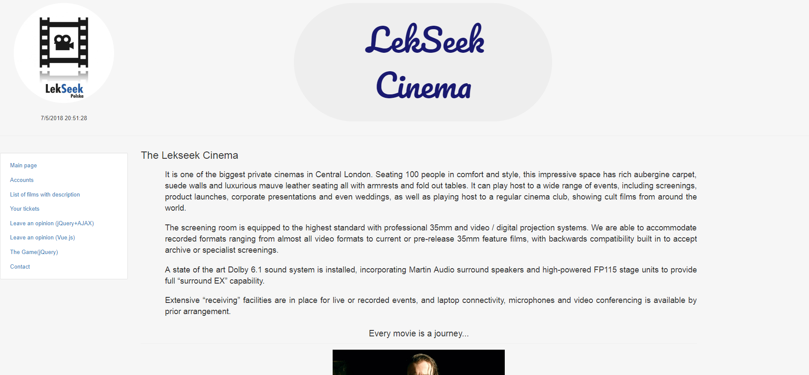

# LekSeek_Django_Recruitment_Project
A simple Django application for cinemas written for the sake of recruitment process for LekSeek Poland.
Requirements: login, authorization, ticket reservation, viewing available films.

Tech used: Python Django, Javascript + jquery, AJAX, CSS, HTML, Bootstrap, Jinja.

This is my first Django project, I built mainly with the help of Python Web Development with Django (Developer's Library) by Jeff Forcier and https://code.djangoproject.com/wiki/Tutorials.
